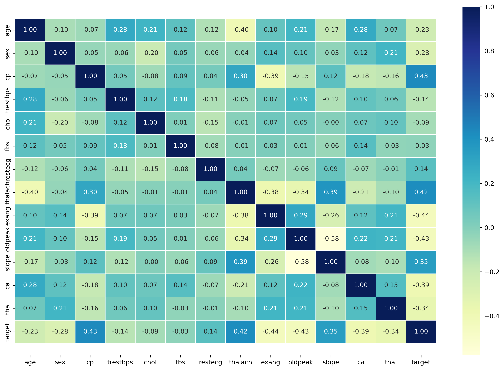
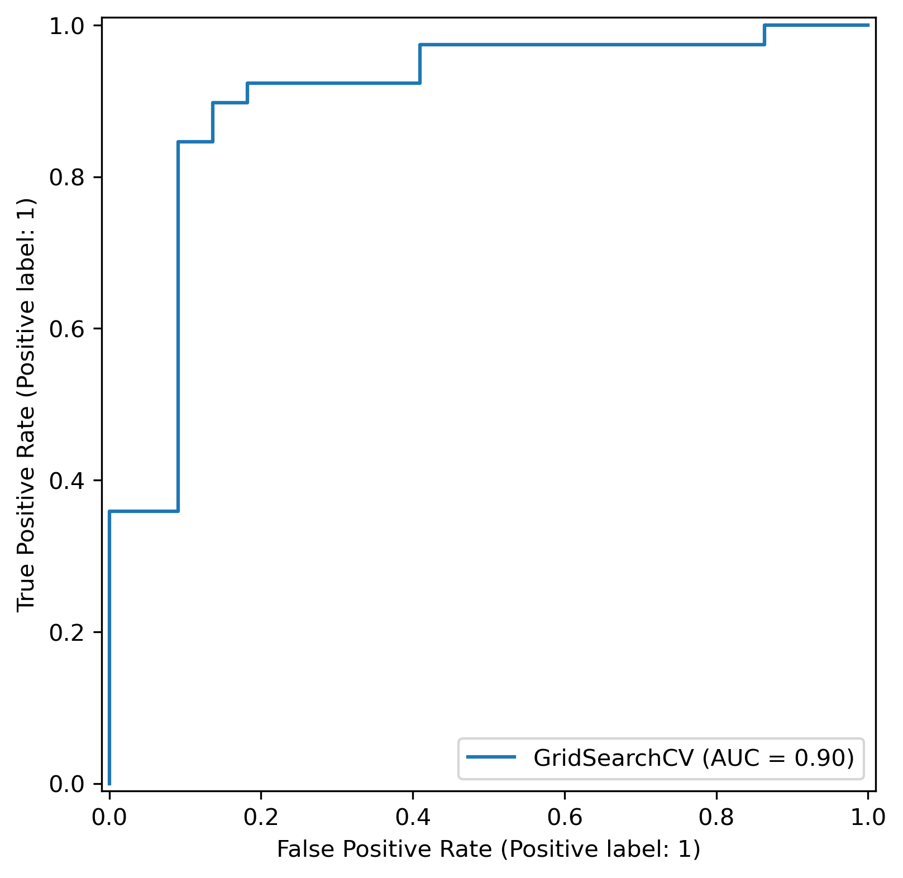
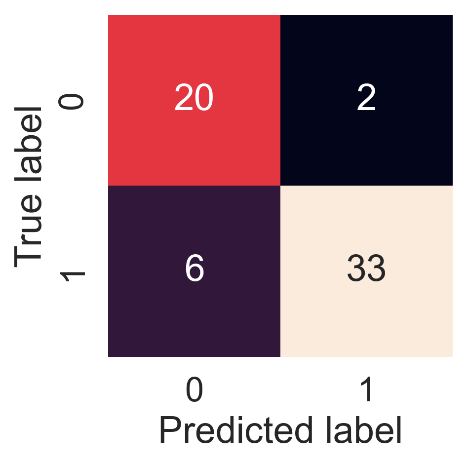
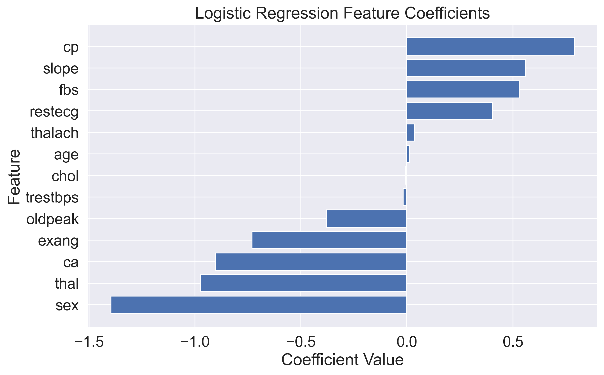

# Heart Disease Classification

Machine learning classification project predicting the presence of heart disease using clinical patient data.

The project demonstrates an end-to-end machine learning workflow, including:

* Exploratory Data Analysis (EDA)
* Feature correlation analysis
* Baseline model comparison
* Hyperparameter tuning
* Cross-validation
* Model evaluation
* Feature importance analysis

The primary goal was to identify which machine learning model performs best on this dataset while maintaining interpretability and reproducibility.

---

## Project Overview

Heart disease remains one of the leading causes of death worldwide. Early identification of high-risk patients can support medical decision-making and preventive treatment.

This project uses a publicly available heart disease dataset and evaluates multiple machine learning algorithms for binary classification.

Target variable:

* `0` = No heart disease
* `1` = Heart disease

---

## Dataset

Dataset source:

* UCI Heart Disease Dataset

Dataset characteristics:

* ~300 patient records
* 13 clinical features
* Binary classification target

Example features:

| Feature  | Description                       |
| -------- | --------------------------------- |
| age      | Age of patient                    |
| sex      | Patient sex                       |
| cp       | Chest pain type                   |
| trestbps | Resting blood pressure            |
| chol     | Serum cholesterol                 |
| thalach  | Maximum heart rate achieved       |
| exang    | Exercise-induced angina           |
| oldpeak  | ST depression induced by exercise |

---

## Exploratory Data Analysis

The EDA phase focused on:

* Dataset structure and quality checks
* Target class distribution
* Relationship between demographic features and heart disease
* Correlation analysis
* Identification of potentially informative predictors

## Correlation Analysis



Key observations:

* Chest pain type (`cp`) showed a strong relationship with the target variable.
* Maximum heart rate (`thalach`) demonstrated meaningful correlation with heart disease.
* Exercise-induced angina (`exang`) and ST depression (`oldpeak`) appeared to be strong predictors.
* The dataset contains more male than female patients.

---

## Models Evaluated

Three baseline models were evaluated:

| Model                     | Purpose                       |
| ------------------------- | ----------------------------- |
| Logistic Regression       | Interpretable linear baseline |
| K-Nearest Neighbors (KNN) | Distance-based classification |
| Random Forest             | Ensemble tree-based model     |

Baseline performance comparison identified Logistic Regression as the strongest-performing model.

---

## Hyperparameter Tuning

Model performance was improved through:

### RandomizedSearchCV

Used for efficient exploration of larger hyperparameter spaces.

### GridSearchCV

Used to perform a more focused search around promising parameter values.

The final model was selected based on cross-validation performance.

---

## Results

### Test Set Performance

| Metric    | Score |
| --------- | ----- |
| Accuracy  | ~87%  |
| Precision | ~94%  |
| Recall    | ~85%  |
| F1 Score  | ~89%  |
| ROC-AUC   | ~0.90 |

## ROC Curve



## Confusion Matrix



### Cross-Validated Performance

| Metric    | Score |
| --------- | ----- |
| Accuracy  | 0.822 |
| Precision | 0.818 |
| Recall    | 0.873 |
| F1 Score  | 0.843 |

The model demonstrated stable performance across folds, suggesting reasonable generalization despite the relatively small dataset size.

---

## Feature Importance

Feature importance was analyzed using Logistic Regression coefficients.



The most influential features included:

* Chest pain type (`cp`)
* ST segment slope (`slope`)
* Exercise-induced angina (`exang`)
* Number of major vessels (`ca`)
* Thalassemia result (`thal`)

These findings were broadly consistent with insights identified during exploratory data analysis.

---

## Future Improvements

Potential next steps include:

### More Data

The dataset contains approximately 300 observations, limiting the model's ability to generalize.

### Additional Models

Future experiments could evaluate:

* XGBoost
* LightGBM
* CatBoost

### Feature Engineering

Potential improvements:

* Scaling numerical features
* Interaction features
* Feature selection techniques

### Production Deployment

To move toward a production-ready workflow, the model could be:
* Containerized with Docker
* Tracked with MLflow
* Integrated into a CI/CD pipeline

## Model Export

The final tuned Logistic Regression model was exported using Joblib and stored in:
models/heart_disease_model.pkl
The model can be loaded and used for future predictions without retraining.

---

## Technologies Used

* Python
* Pandas
* NumPy
* Matplotlib
* Seaborn
* Scikit-Learn
* Jupyter Notebook

---

## Repository Structure

```text
heart-disease-classification/
│
├── data/
│   └── heart-disease.csv
│
├── images/
│   ├── correlation_heatmap.png
│   ├── roc_curve.png
│   ├── confusion_matrix.png
│   └── feature_importance.png
│
├── models/
│   └── heart_disease_model.pkl
│
├── notebooks/
│   └── heart_disease_classification.ipynb
│
├── README.md
├── requirements.txt
└── .gitignore
```

---

## Author

Eugene Anufriev, Senior Systems Reliability Engineer at Nutanix, AI/ML, AI Infra and MLOps Enthusiast.
